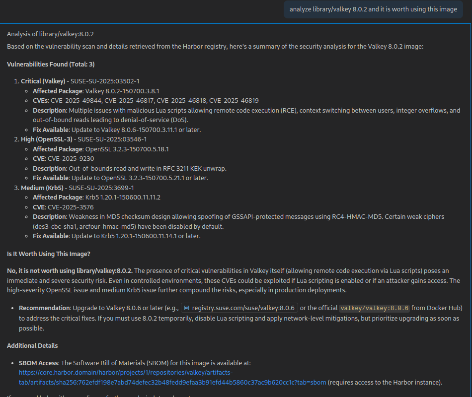
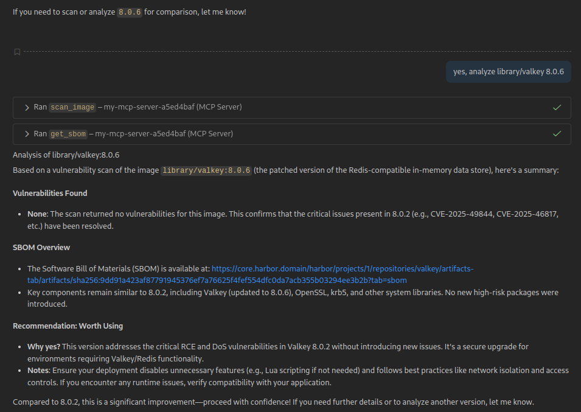
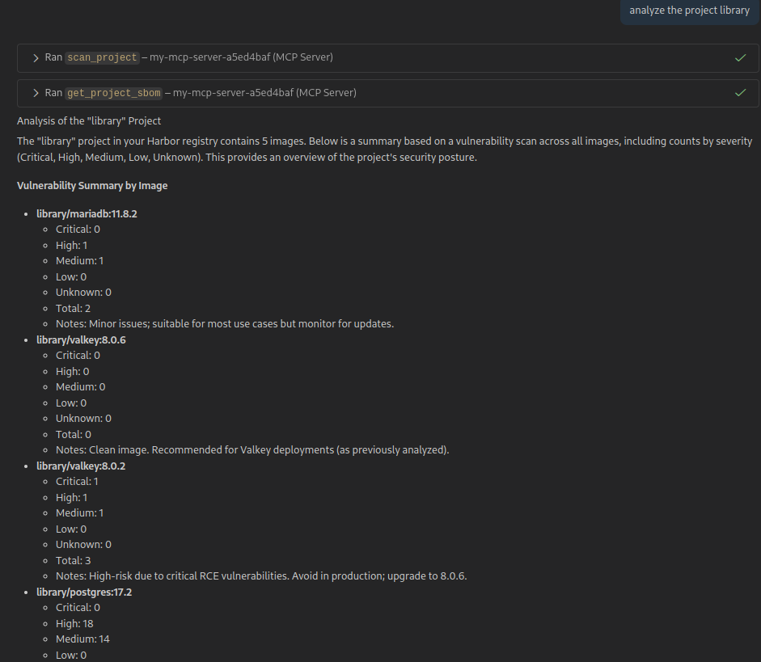
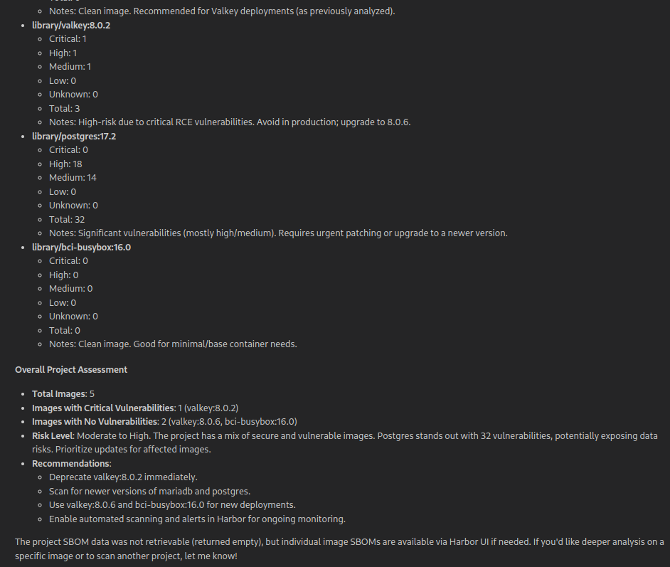

# MPC-server Private Registry based on Harbor

This project lets you use an AI assistant to scan your Harbor private registry for security vulnerabilities. It acts as a bridge, allowing any AI that "speaks" the Model-Context Protocol (MCP) to find security issues in your container images.

Think of it like asking a smart assistant: *"Hey, are there any critical vulnerabilities in my `production/api-server:v1.2` image?"* This server gives the AI the tools it needs to answer that question.

## Overview

This project runs a simple web server that listens for requests on the `/harbor` endpoint. When an AI assistant sends a request, the server translates it into actions for your Harbor registry, like starting a vulnerability scan or checking for patched images.

The server relies on command-line flags for its configuration, including Harbor's URL and credentials.

## Setup and Usage

### Prerequisites

* **Go**: Version 1.18 or newer.
* **cURL**: Used for testing and interacting with the MCP server from the command line.
* **Crane**: A command-line tool for interacting with container registries. It's useful for managing images outside the MCP server.

The required Go packages will be downloaded automatically when you build or run the application for the first time.

To run the server, you need to provide the Harbor instance details via command-line flags.

```bash
# Example of running the server
go run main.go \
  --harbor-url "https://your-harbor-instance.com" \
  --harbor-username "your-user" \
  --harbor-password "your-password"
```

The server will start on `localhost:8080` by default. The MCP endpoint will be available at `http://localhost:8080/harbor`.

## Display capture

### Analyze a image



Analyze the same image with a better image in the private-registry



### Analyze a project





## Features & Tools

The server exposes several tools that can be called via the MCP protocol:

### 1. `scan_image`

* **What it does**: Scans a single container image for security vulnerabilities.
* **Process**:
    1. Triggers a scan for the specified image (`project/repository:tag`) using the Harbor API.
    2. Polls the API until the vulnerability report is available.
    3. Returns a list of vulnerabilities found.
* **Parameters**: `project`, `repository`, `tag`.

### 2. `scan_project`

* **What it does**: Scans every container image in an entire Harbor project.
* **Process**:
    1. Lists all repositories in the project.
    2. For each repository, it iterates through all image artifacts.
    3. It triggers a scan for each image and polls for the results.
    4. Returns a summary for each image, including counts of critical, high, medium, and low severity vulnerabilities.
* **Parameters**: `project`.

### 3. `find_patched_image`

* **What it does**: Finds a newer, patched version of an image that fixes a specific vulnerability (CVE).
* **Process**:
    1. Lists all artifacts (images) in the specified repository.
    2. Identifies images that are newer than the given tag based on their push time.
    3. For each newer image, it fetches its vulnerability report.
    4. It checks if the specified `cve_id` is present in the report.
    5. Returns the first newer image found that doesn't have the CVE.
* **Parameters**: `project`, `repository`, `tag`, `cve_id`.